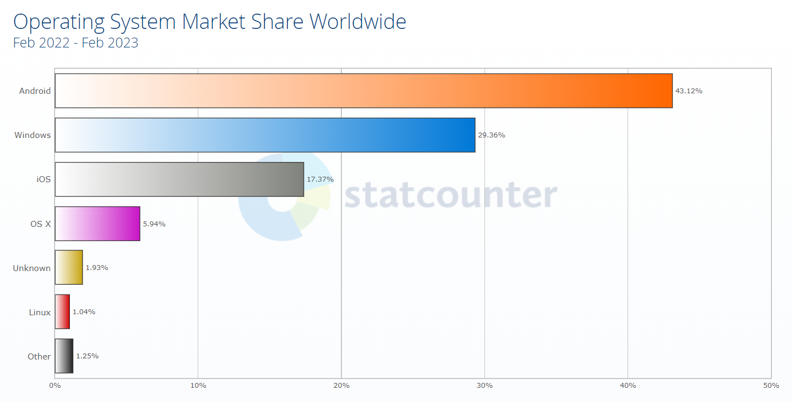
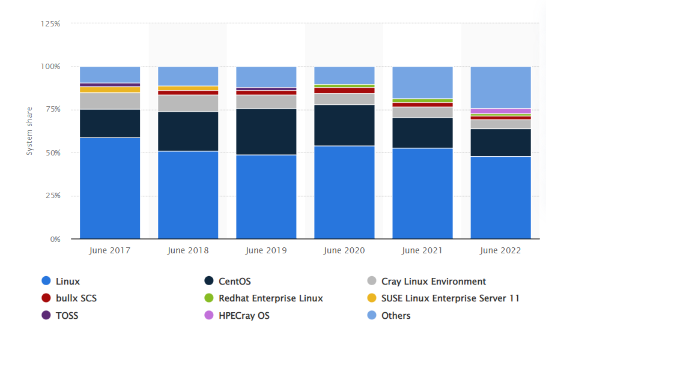

# Overview

> 500 siêu máy tính mạnh nhất thế giới (thời điểm 17/11/2022) sử dụng hệ điều hành Linux [[1](https://www.stackscale.com/blog/most-powerful-supercomputers-linux/)]

#### [1. Lịch sử Linux](#1)

#### [2. Thông tin cơ bản](#2)

### 1. Lịch sử Linux 

##### 1.1 Hệ điều hành

​	Hệ điều hành là **phần mềm** có chức năng quản lý phần cứng và tất cả các phần mềm khác trên hệ thống máy tính, đồng thời cung cấp các dịch vụ, thư viện, tài nguyên dùng chung cho các chương trình máy tính khác.

​	Xét về độ phổ biến, hệ điều hành cho desktop hiện nay có thể chia thành 2 nhóm: Windows và phần còn lại.

](./images/market_share_os_desktop.png)

​	Tuy nhiên khi xét đến tất cả các thiết bị máy tính phổ biến (bao gồm pc, mobile, tablet và console), [Unix và Unix-likes](#1.2) lại là hệ điều hành chiếm phần lớn thị phần.

​	Và đặc biệt đối với các thiết bị chuyên nghiệp (server, supercomputers), Linux ( và các distribution Linux) là hệ điều hành gần như duy nhất được tin dùng (2022).

[^bullx SCS, TOSS, CentOS ... đều là các distribution Linux]: 

##### 1.2 Unix, Unix-like 

​	Theo wiki, hệ điều hành Unix được hình thành và triển khai vào năm 1969, tại Phòng thí nghiệm Bell của AT&T và phát hành lần đầu năm 1971.

### 2. Thông tin cơ bản 

